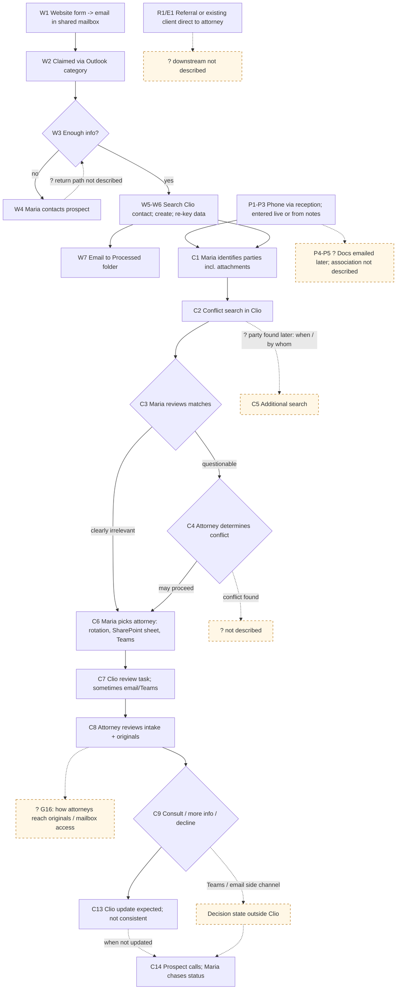
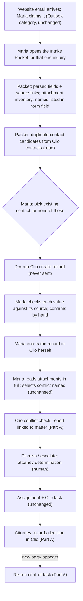

# MatterMind intake V1 proposal (for Drew's review)

> **PARKED: DISCOVERY EVIDENCE ONLY. NOT APPROVED FOR IMPLEMENTATION.**
>
> - **CONSTRAINT:** On Oct 2, 2026, Drew Reutlinger chose option **(c) Park intake** from §0 below. The approved MatterMind V1 remains the read-only active-matter status brief ([`mvp-selection.md`](../../mvp/mvp-selection.md)). No intake code exists in this repository and none is to be built under this track.
> - Everything below, including §0's recommendation and §4 "Proposed V1", is kept as a record of the discovery work, not as a plan.
> - Edits made when parking: this banner; working-copy paths replaced with repository paths; one local backup-file path removed from the traceability note. The text is otherwise unchanged from the version reviewed on Oct 2, 2026.
> - `brief.md`, `analysis-*.md` and `challenge-*.md` are team working files that are not committed. They are condensed in [`team-analysis-summary.md`](./team-analysis-summary.md). The Clio public-doc links from `analysis-recondo.md` Part B are reproduced in [`reopening-research-plan.md`](./reopening-research-plan.md).
> - See [`README.md`](./README.md) for the track status and [`reopening-research-plan.md`](./reopening-research-plan.md) for what would justify reopening.

Prepared by Duke (chief of staff), Fri Oct 2, 2026 (MT). This is for review only: nothing has been built and no repo has been changed. The engagement is simulated, so every person, the firm and all data are fictional.

**Evidence rules.**
- Every FACT traces to one of three interviews: 001 (Rachel Morgan, Director of Legal Operations; the record is PARTIAL), 002 (Maria Santos, Intake Coordinator) or 003 (David Chen, Employment Attorney). Cites look like `[002 L55]`, the line number in the `docs/discovery/` record as of commit `5c9015c`.
- Labels: FACT; OBSERVATION, marked '(source)' when the interview record itself says it; HYPOTHESIS; OPEN QUESTION; CONSTRAINT. **CONTEXT** marks the repo's MVP and architecture docs.
- Every Clio feature claim is **UNVERIFIED**. These claims come from Recondo's reading of Clio's public docs on Oct 2, 2026 (`analysis-recondo.md` Part B). The firm's plan tier and configuration are unknown, and stages and automations may need Signature or higher.
- Interviews 004 and 005 are not used. Filecard found no independent intake facts in them.
- Double quotes mark verbatim text from the cited file. Single quotes mark proposed UI text or team terms.

---

## 0. Decision needed from Drew

**This intake V1 conflicts with the approved V1.**
- The approved V1 is "read-only active-matter status reconstruction" (CONTEXT `mvp-selection.md` L5). Its architecture is done and its synthetic slice is in progress (ARCH `mattermind-v1-architecture.md` L479–483).
- Its non-goals include "Automate prospective-client intake." (ARCH L442) and "… or update Clio." (ARCH L446).
- The MVP selection reserved intake "pending stronger evidence of volume, pain, or cost" (`mvp-selection.md` L95), because discovery "did not establish sufficient pain, volume, or return on investment" (L24).
- This proposal adds no new evidence. 001–003 still contain no volume or frequency figures [002 L184–188; 003 L159–160].

| Option | Meaning | For | Against |
|---|---|---|---|
| **(a) Replace** | Intake becomes V1; the status slice pauses | The evidence comes from frontline staff and points to fixes that may be largely deterministic (HYPOTHESIS) [002 L51–55; 003 L139] | Reverses a documented selection without new volume evidence; strands the slice work |
| **(b) Second track** | Build both | Both lines of learning continue | Two scopes, two fixture sets and two non-goal lists for one builder |
| **(c) Park intake** | Keep the status V1; file this as evidence for later | Consistent with the documented selection; keeps the slice's momentum | Re-keying and conflict-coverage findings wait |

**Duke's recommendation.** (b) is likely wrong for a solo builder, so pick (a) or (c). Either choice is cheap. The build part of this V1 (Part B) is one small, deterministic, read-only tool on synthetic data. Part A is advice to the firm with no code, so it holds under any option.

**Evidence weight.**
- The evidence base is one coordinator, one attorney, and Rachel's partial notes [001 L9].
- Two quotes credited to Rachel can't be traced to 001, and neither is used: "Information is not consistently returned to Clio." (002 L205) and "Where are we on this matter?" (003 L109).
- Stale post-handoff state in Clio therefore rests on Maria and David alone [002 L97–98; 003 L82].
- CONSTRAINT: their agreement "must not be treated as proof that every practice group or employee follows the same process" [002 L209].

**Executive summary**
1. **Observed problems.** Website data is re-keyed into Clio by hand, and manual entry has produced errors and duplicate contacts [002 L51–55]. Parties have occasionally surfaced after the first conflict check, and attorneys have had to ask whether people were checked [002 L64–67]. Attorney decisions don't reliably reach Clio, so intake chases status [002 L97–100; 003 L81–83].
2. **Part A (recommendation, no build).** Record intake decisions in Clio. Use Clio's conflict report as the coverage record. Add a re-run conflict task when new parties appear, and an 'other people involved' field on the website form. Every Clio feature is UNVERIFIED.
3. **Part B (small build): the Intake Packet**, for website inquiries only. It parses form fields deterministically and source-links each one, lists duplicate-contact candidates and attachments, and produces a dry-run 'Clio create' record that Maria confirms by hand. It is read-only, runs on synthetic data, and makes no Clio writes.
4. **Out of V1.** AI party-name extraction (gated as a V1.1 candidate), any 'cleared' or 'all names searched' indicator, conflict decisions, routing, prospect messages, document filing, claim locks, attorney summaries, and the phone, referral and existing-client paths.
5. **Measure before building more.** Collect 2–4 weeks of baseline counts: status-chasing messages, re-typing time, duplicate contacts and late-found parties.

---

## 1. Current workflow (condensed from Filecard)

Status key: **KNOWN** = a cited FACT; **ASSUMED** = a HYPOTHESIS; **GAP** = an OPEN QUESTION. Step IDs follow `workflow-reconstruction.md`.

| Step | What happens | Status |
|---|---|---|
| W1 | The form becomes an email in the shared Outlook mailbox "New Client Intake" [002 L20, L22]. Submitted information "can include" name, email, phone, help type, referral source, free text and attachments [002 L23]. OBSERVATION (source): the email "did not itself appear to create a record in Clio" [002 L25]. | KNOWN. Form platform: GAP [002 L181] |
| W2 | One of four mailbox users claims the email with an Outlook category. Opening it does not claim it [002 L21, L31, L33]. | KNOWN |
| W3–W4 | Maria reads the submission, judges whether there is enough to proceed, and contacts the prospect if needed [002 L41, L44]. | KNOWN. Where the results are recorded: GAP |
| W5–W6 | Maria searches Clio for the person, creates the contact if none exists, and re-keys contact and basic matter information [002 L48–51]. | KNOWN. How a "prospective matter" is represented in Clio: GAP (G3) |
| W7 | After Clio entry, the email moves to a Processed folder [002 L32]. | KNOWN. Order relative to C1: ASSUMED |
| P1–P5 | Phone: reception transfers the call, Maria enters data live or from notes, and documents emailed in later must then be associated with the intake [002 L106–111]. | KNOWN. How, where and by whom association happens: GAP. Search-before-create on the phone path: ASSUMED (A1) |
| R1, E1 | Referrals, and existing clients with new issues, may go directly to attorneys [001 L24–25]. | KNOWN entry; everything after it is a GAP |
| C1–C2 | Maria identifies parties, including from attachments, and runs the conflict search in Clio [002 L59–63, L71]. | KNOWN. Global search vs Conflict Check feature: GAP |
| C3–C4 | Maria dismisses clearly irrelevant matches and escalates questionable ones. An attorney determines conflict and whether to proceed [002 L75–77; 001 L43]. | KNOWN. Channel, recipient, criteria and record: GAP |
| C5 | Late-found parties need an additional search [002 L64–65]. | KNOWN. Trigger and owner: GAP |
| C6–C7 | Maria picks the attorney from practice area, rotation, a SharePoint sheet and Teams [002 L82–89]. She assigns the matter and creates a Clio review task, sometimes adding an email or Teams message [002 L93–94]. | KNOWN. Rotation rules: GAP |
| C8–C9 | The attorney reviews the intake and the originals. The originals are in Clio, or found "through Outlook or another linked location" [003 L26, L31–33]. The attorney then decides: consult, more information, or decline [002 L96]. | KNOWN for David only [003 L154]. How attorneys reach originals, and whether they can access the shared mailbox: GAP (G16) |
| C10–C12 | Consult: Clio task and/or Teams to the assistant [003 L61–64]. More information: a Clio note or task, or email/Teams [003 L72–73]. Decline: expected in Clio [003 L82]. | KNOWN. Replace vs accompany: GAP (G17). Who tells the prospect: GAP (G10) |
| C13–C14 | The Clio update "does not happen consistently" [002 L98]. When a prospect calls, Maria asks the attorney or the assistant [002 L99–100]. | KNOWN |

**Top contradictions.** Filecard found no head-on CONTRADICTION, only tensions and omissions:
- **X1 (TENSION).** "A conflict check occurs before substantive attorney involvement." [001 L37] Yet parties are sometimes found after the original check [002 L64, L67]. Rachel's own record anticipates this [001 L45].
- **X2 (UNRECONCILED).** Direct-to-attorney paths exist [001 L24–25]. Neither Maria nor David describes them, so how the conflict check applies there is unknown.
- **X5 (CORROBORATED, with different emphasis).** David updated Clio in the observed example (OBSERVATION (source)) [003 L59], yet he sometimes uses Teams [003 L63, L73], and Maria says the update is inconsistent [002 L98].
- **X6 (UNRECONCILED).** Maria never says attachments go into Clio, and David sometimes digs originals out of Outlook [003 L33]. Document custody is a GAP (G4).

---

## 2. Findings across the seven lenses

**2.1 Manual and duplicate work**
- FACT: Maria re-keys website data into Clio [002 L51] and would like to stop [002 L143]. OBSERVATION (source): she switches repeatedly between Outlook and Clio [002 L52].
- FACT: two staff occasionally begin the same inquiry at about the same time [002 L34].
- FACT: Maria opens attachments to find conflict names [002 L63]. A late-found party forces another search [002 L65].
- FACT: Maria may add an email or Teams message to the Clio task [002 L94]. HYPOTHESIS (Dial-Tone A11): this is redundancy covering an unreliable channel, not waste.
- FACT: Maria sometimes has to chase status by hand [002 L99–100; 003 L83].
- FACT: David re-reads originals, and this "does not imply distrust" [003 L31–32, L36]. OBSERVATION (team): this is not a target for removal.

**2.2 Lost or stale information**
- FACT: the availability sheet "is not always current" [002 L88]. Part of the rotation is institutional knowledge [002 L86].
- FACT: the post-decision Clio update is inconsistent [002 L98], and a matter that isn't updated looks pending [003 L82].
- FACT: requests for more information may go by email or Teams "instead" [003 L73]. OBSERVATION (source): "Relevant workflow state can therefore exist outside Clio." [003 L74]
- FACT: re-keying has produced wrong phone numbers, misspelled names and duplicate contacts [002 L54], e.g. "Robert Smith" versus "Bob Smith" [002 L55].
- FACT: attorneys have asked whether particular people were checked and found they were not included in the original search [002 L67].
- FACT: Maria knows of no inquiry that was completely lost [002 L37]. OBSERVATION (Dial-Tone §2.2 row L11): the only loss detector described is the prospect calling back [002 L36], so any silent drops would go uncounted.

**2.3 Bottlenecks and handoffs**
- FACT: inquiries sometimes stay unclaimed longer than intended [002 L35]. Prospects have called the next day [002 L36].
- FACT: assignment runs on institutional knowledge, the sheet and Teams [002 L86–89].
- FACT: "some attorneys are better than others about monitoring their Clio tasks" [002 L95].
- FACT: several prospective matters may wait for David. His review estimates are 5–10 minutes (simple) and 20+ minutes (complex) [003 L50–52]. CONSTRAINT: these are estimates and must not be used for ROI [003 L53–54].
- OPEN QUESTION: the conflict-escalation channel, recipient and turnaround are not described [002 L76].

**2.4 Human-judgment decisions**
- FACT: what the inquiry is about and whether there is enough to proceed. Prospects sometimes pick the wrong practice area [002 L41–42].
- FACT: which names go into the conflict search. Documents mention unrelated people [002 L146–147].
- FACT: dismissing or escalating matches [002 L75–76]. OPEN QUESTION: the dismissal criteria.
- FACT / CONSTRAINT: the attorney determines whether a conflict exists [001 L43]. Human judgment is intentional [002 L78], and Maria doesn't want software deciding [002 L145, L176].
- FACT: which attorney gets the matter [002 L82], and whether to consult, ask for more, or decline [003 L78–79]. CONSTRAINT: "Do not infer that attorneys want AI making intake-acceptance decisions." [003 L147]
- FACT: whether extracted information can be trusted. David "would not trust a generated summary by itself" [003 L98].

**2.5 Safely deterministic decisions** (all HYPOTHESIS)
- Parsing labelled form fields. The form "places submitted information into an email" [002 L22–23], but the platform is unknown [002 L181].
- Duplicate-contact *candidates* from normalized email or phone, and name variants. Never merged [002 L48, L55].
- An attachment inventory of the inquiry email. Phone-path association is *not* deterministic [002 L111].
- Practice area shown 'as submitted', never as a classification [002 L42].
- HYPOTHESIS (source): "Some intake workflow problems may be deterministic workflow or integration problems rather than AI problems." [003 L139]
- Not deterministic: routing, because the availability sheet "is not always current" and part of the process "exists as institutional knowledge among staff" [002 L86–88]; and finding parties in documents [002 L144–147].

**2.6 Clio helping vs. worked around**
- FACT (helping): conflict search across current and former clients, matters and associated parties [001 L39, L52]; contact search before creating a contact [002 L48]; the formal task handoff [003 L23–24]; six years of history and billing [001 L50, L59–61].
- FACT (worked around): Outlook categories and the Processed folder [002 L30–32]; the SharePoint sheet and Teams [002 L87–89]; extra email or Teams messages on handoff [002 L94]; Teams to the assistant [003 L63]; email or Teams to intake [003 L73]; originals in Outlook [003 L33].
- OBSERVATION (source): staff "have developed compensating processes around workflow gaps" [002 L155]. OBSERVATION (team): the workarounds cluster at transitions between people, not in Clio's record functions.
- CONSTRAINT: "Do not characterize Clio as failing or being rejected by users." [003 L151] No new independent system that employees must maintain [001 L63].

**2.7 Questions to answer before building** (owners in §5)
- OPEN QUESTION: how prospective matters and decisions are represented in Clio [003 L163].
- OPEN QUESTION: the plan tier, API and website integration [002 L182–183].
- OPEN QUESTION: volumes and the frequency of errors, duplicates and late parties [002 L184–188].
- OPEN QUESTION: why attorneys bypass Clio [003 L165].
- OPEN QUESTION: whether intake uses Conflict Check or plain search, and whether dismissals are recorded (Dial-Tone CQ1) [002 L75, L197].

---

## 3. Where the team disagreed and how it was resolved

| Topic | Who said what | Final call and why |
|---|---|---|
| **Config vs. Packet** | **Recondo:** the post-handoff problems are Clio config and adoption gaps; build only a capture bridge, and only if there's no Grow. **Mainframe:** build a read-only Packet at the front door. Recondo's count: the Packet touches more problems (7 vs 3) but neither of the two problems corroborated by two roles. **Mainframe:** no interview mentions Pending, stages or notify settings, so 'config gap' is a HYPOTHESIS. **Dial-Tone:** stage-triggered tasks may fail (silently or with an error, which is unclear) when the responsible attorney is missing (UNVERIFIED). | **Both.** Part A covers the post-handoff problems (recommendation, all UNVERIFIED). Part B covers the front door. The two work on opposite ends of the pipeline and don't conflict once MatterMind writes nothing to Clio. Grow becomes an open buy-vs-build question. |
| **Packet state** | **Recondo:** Mainframe's party worksheet and Search Coverage entity are a second record [001 L63–64]. | **Mainframe dropped them.** V1 holds no workflow state. |
| **AI name suggestions** | **Maria** asked for this, with her review [002 L144, L146]. **Recondo:** drop the feature rather than the bar. **Mainframe:** the cheapest version is about 25 synthetic inquiries, two-layer gold labels, 100% recall on must-find mentions, and provenance as a hard gate. **Dial-Tone:** fails safety, because "A name that is never suggested can't be rejected"; it passes only if the manual read stays mandatory. | **Out of V1 core; a gated V1.1 candidate** (§4.8). Its misses look like a clean result, and in V1 it could only produce fixtures. |
| **Dial-Tone's bar** | The original bar (historical replay, shadow mode, matching a human baseline) can't run on synthetic data, and no baseline exists [002 L188]. | **Split** (Dial-Tone's own revision). A synthetic hard gate proves the logic. Real-data gates must pass before anyone relies on the tool. |
| **Coverage flag** | **Mainframe** rule 5: accepted minus searched gives 're-search needed'. **Dial-Tone:** the 'searched' input is hand-set or unavailable, so the flag can give a false 'searched', and "searched" is not "cleared". Mainframe conceded. | **Out.** No 'cleared', 'all names searched' or 'complete' state anywhere. Clio's own report is the record (Part A). |
| **Decision-capture UI** | **Recondo** and **Dial-Tone** #11 proposed one. **Mainframe:** one more channel attorneys can skip, when the cause is unknown [003 L165]. | **Out.** Recondo withdrew it. |
| **Claim lock / ownership** | **Recondo** 5.1 and **Dial-Tone** E2 proposed a lock. **Mainframe:** lock state would live outside Clio [001 L63]. | **Out.** The read-only ownership display, which passed Dial-Tone's safety and testability checks, is also deferred: it needs real M365 access and alert thresholds that don't exist yet. |
| **Auto document filing** | **Recondo** 5.4 proposed it. **Mainframe** and **Dial-Tone:** phone-path association is a judgment [002 L111], and a misfile could be a silent confidentiality breach (HYPOTHESIS). | **Out.** Part B only *lists* the attachments on the inquiry email. |

---

## 4. Proposed V1

### Part A: Clio configuration and practice change set (recommendation, not a build)
Every feature here is **UNVERIFIED** for this firm. A Clio admin session must confirm each one (§5).

| Change | Evidence | Failure mode |
|---|---|---|
| A1. Attorneys record consult, more-info or decline in Clio's status, stage or task, not in Teams or email | [002 L97–98; 003 L73, L81–82] | The cause is unknown [003 L165], so the habit may persist. A new matter defaults to the first stage, so an unmoved matter looks legitimate. Stage-triggered task lists error when the responsible attorney is missing. Stages are plan-gated. |
| A2. Coverage recorded in Clio's own conflict report, linked to the prospective matter | [002 L67] | The report shows what was searched, not what should have been. Linking is manual. A clean result on an incomplete index looks like a true clean result (Dial-Tone M11). |
| A3. A re-run conflict task when new parties appear | [002 L64–65] | It sees only parties someone records [001 L45]. It must never be read as 'no re-run needed'. |
| A4. An 'other people or organizations involved' field on the website form | OBSERVATION (Mainframe): none of the fields 002 lists asks for parties [002 L23], but that list is only "can include", so the form may already ask (OPEN QUESTION; confirm before recommending); parties may appear only in documents [002 L61] | Prospects omit names [002 L62]. The field supplements Maria's full read and never replaces it. The form platform is unknown [002 L181]. |

### Part B: the Intake Packet (the only build)

**4.1 End-to-end user workflow** (website inquiries only; Part A steps marked)

**4.2 Screens** (two)
1. **Inquiry picker.** Lists the synthetic inquiries the user is authorized to see, and the user selects one. It shows no queue, owner or age.
2. **Intake Packet.** One page with four panels and a scope banner:
   - *Fields:* each value next to its source excerpt, with 'Unknown' plus the raw text when a field can't be parsed.
   - *Contact candidates:* tiered, showing the match basis, with 'use this contact' and 'none of these' options and no merge.
   - *Attachments:* filename, type and size, each opening the original, with the footer 'Documents emailed separately are not included.'
   - *Dry-run Clio create:* a read-only record with a 'checked' tick per field and a Confirm button that only writes to a log.
   - *Banner:* 'Read: this email, synthetic Clio contacts. Not read: Teams, SharePoint, attorney inboxes. Not a party list; no conflict status.'

**4.3 Core entities** (conceptual, not schemas)

| Entity | Fields | Evidence |
|---|---|---|
| Inquiry (derived, not stored as a record) | message id, mailbox, received-at, sender, raw body ref | [002 L20, L22] |
| SourceRef | artifact id, location (field label or span), excerpt | [003 L99–101] |
| ParsedField | label (name, email, phone, help type, referral source, description, other people), value or Unknown, SourceRef | [002 L23] |
| Attachment | inquiry id, filename, type, size, SourceRef | [002 L23–24] |
| ContactCandidate | Clio contact id, tier, match basis, matched values | [002 L48–49, L55] |
| DryRunCreate | contact fields, prospective-matter placeholder (shape pending G3), practice area 'as submitted', candidate resolution | [002 L51; 003 L163] |
| ConfirmationLog (synthetic test harness only) | inquiry id, fields ticked, confirmed-at | Scores the §4.8 gates; not workflow state |

No entity holds claim, review, coverage or decision state.

**4.4 Deterministic rules**

| Rule | Evidence | Failure mode → guard |
|---|---|---|
| R1. Parse by form label only; an unrecognized label becomes Unknown | [002 L22–23] | Template drift mis-maps a field → unknown labels never map, and the raw text is shown |
| R2. Practice area shown 'as submitted' | [002 L42] | Read as a classification → fixed label; nothing routes on it |
| R3. Normalize email and phone for matching only; display the original | [002 L54] | Normalization hides a typo → the original is shown beside its source |
| R4. Duplicate tiers: (1) exact email or phone, (2) exact normalized name, (3) a fixed nickname table (Robert/Bob). Suggest only | [002 L48, L55] | FN: a duplicate is created, as today. FP: the wrong person's record is chosen → explicit choice, match basis shown, no merge |
| R5. No confirm until candidates are resolved and every field is ticked | [002 L53–54] | Rubber-stamping → tick behaviour is measured; the tool never writes |
| R6. The inventory covers only attachments on this email | [002 L23, L111] | Read as the full document set → footer |
| R7. No value is shown without a SourceRef whose excerpt is found at its location | [003 L98–101] | An unsourced value → hidden |
| R8. Authorization before parsing (fixture list mirroring the four mailbox users) | [002 L21; 003 L172] | Attorneys locked out of originals (`challenge-recondo.md` §1.3) → G16 |
| R9. The 'other people' field is passed through verbatim, labelled 'listed by prospect', with no count or completeness wording | [002 L61–62] | Maria skips the attachment read → banner; no 'complete' state exists |

**4.5 Human-controlled steps**
- Choosing conflict-search names, and dismissing matches.
- Conflict determinations.
- Attorney assignment.
- Accepting or declining.
- All prospect communication.
- Resolving duplicate candidates.
- Confirming every Clio record field by field and entering it in Clio.

**4.6 Integration points**

| System | V1 | V1 data | Later, needs |
|---|---|---|---|
| Outlook shared mailbox | Read | Synthetic .eml fixtures | Real M365 access (out of scope today) |
| Clio contacts | Read | Synthetic contact fixture | Clio API v4 contacts endpoint; plan and API access UNVERIFIED [002 L183] |
| Clio create contact or matter | **None** (dry-run) | — | Drew's write decision (§5) plus the G3 object model |
| Clio conflict check | None | — | UNVERIFIED: no conflict-check endpoint found in the public API (Recondo B.4) |
| Clio tasks, status, stages | None | — | Part A, set up by the firm's admin |
| Website form, Teams, SharePoint | None | The fixture includes the A4 field | A4 is a change on the firm's side |

**4.7 Explicitly out of scope**
- AI party-name extraction (V1.1 candidate only).
- 'Conflict cleared', 'all names searched' or any coverage indicator.
- Automated conflict decisions or dismissals.
- Attorney assignment or a shortlist.
- Auto-acknowledging prospects.
- Automatic document filing or association.
- Claim locks, ownership display, aging alerts, and any state held outside Clio [001 L63].
- The phone, referral and existing-client paths.
- AI summaries or chronologies for attorneys (Recondo's over-build warning). Clio's Document Analyzer (UNVERIFIED) should be evaluated first.
- A decision-capture UI.
- Any Clio or M365 write.
- Anything touching the active-matter status work.

**4.8 Success criteria and test gates**
- **Part B synthetic hard gates.** Use a seeded set of about 25 inquiries, written by someone other than the builder (e.g. Filecard) and modelled on the interview example of three paragraphs, one PDF and two Word documents [002 L24]. It must include: label variants; missing fields; Robert/Bob and misspelled-name duplicates; a former client; a no-match case; a separately emailed document; an unauthorized inquiry; and a filled 'other people' field. Every gate must pass:
  - zero wrong parsed values (each value is either correct or 'Unknown');
  - 100% SourceRef coverage, with every excerpt found at its location;
  - 100% recall on seeded duplicates within tiers 1–3;
  - zero writes and zero merges;
  - no 'clear', 'complete' or 'searched' wording in the UI;
  - the unauthorized inquiry is never parsed, and the separately emailed document never appears.
  
  Precision is reported but not gated.
- **Product success.** Needs a baseline, and Drew sets the targets. Part B: less re-typing time, fewer transcription errors, fewer duplicates. Part A: fewer status-chasing messages, fewer late-found parties.
- **Measure before building more.** Collect 2–4 weeks of baseline counts of status-chasing messages, re-typing time, duplicate contacts and late-found parties. In the simulation these come from the next interview or from Drew. Optional (Mainframe and Dial-Tone T1): reconcile the mailbox against Clio to expose silent drops.
- **V1.1 gate for AI name suggestions.**
  - Add-only: the final list is Maria's list ∪ the accepted suggestions, and the full manual read stays mandatory.
  - A seeded adversarial set of about 25 labelled synthetic inquiries, with two-layer gold labels: every mention (for recall) and relevance (for precision only).
  - **100% recall on the planted must-find parties.**
  - Every suggestion is source-linked.
  - Precision and rejection count are reported.
  - Passing proves the logic only. Before anyone relies on the feature, it also needs historical replay, a shadow run alongside Maria's manual pass, and recall against a human baseline on real data.

---

## 5. Open questions

**Needs another interview**

| Interview | Questions |
|---|---|
| Clio admin / Rachel | Plan tier and Grow; how prospective matters and decisions are represented [003 L163]; existing stages or automations [001 L62]; Conflict Check vs global search, Flex vs Exact; notify-on-assign habit; API access [002 L183]; audit history [002 L197] |
| Maria | Volumes and counts [002 L184–188]; dismissal criteria and whether dismissals are recorded [002 L75]; escalation channel and recipient [002 L76]; who runs late-party re-checks; who the four mailbox users are |
| David plus one attorney from another practice group | Why they use Teams or email over Clio [003 L165]; access to the originals (G16); who tells a declined prospect (G10); how representative David's process is [003 L158] |
| David's assistant | Whether Teams replaces or accompanies the task (G17); where consultations are recorded (G11) |
| Rachel (to complete 001) | The rest of "Microsoft 365 is heavily used for do…" [001 L70]; specific intake complaints; confirm or retract the 002 L205 and 003 L109 attributions; whether Grow counts as "another independent system" [001 L63] |
| Reception; an attorney who receives referrals | The direct-to-attorney paths (G1, G2) |
| Website admin | The form platform, how stable the template is, and whether a party field can be added [002 L181–182] |

**Needs Drew's decision**
1. Option (a), (b) or (c) in §0.
2. Whether a ConfirmationLog limited to the synthetic test harness is acceptable under Rachel's constraint [001 L63].
3. Whether a human-confirmed Clio write is ever allowed (V2), and on what evidence (Mainframe Position B).
4. The product targets. The synthetic gates above are proposed as fixed.
5. Whether to evaluate Clio Grow or Document Analyzer (buy) before building more.
6. Whether V1.1 goes ahead, and who writes the seeded set.
7. The baseline source: the next simulated interview, or figures you supply.

---

## 6. Appendix: file index

| File | Role |
|---|---|
| `brief.md` (working file, not committed) | Drew's ask, labels, phases |
| `docs/discovery/001-…`, `002-…`, `003-…` | PRIMARY evidence (001 partial) |
| `docs/mvp/mvp-selection.md`, `docs/architecture/mattermind-v1-architecture.md` | CONTEXT: the approved active-matter V1 and its non-goals |
| `docs/discovery/open-questions.md`, `docs/discovery/discovery-log.md` (stale at the time), `README.md`, `docs/mvp/v1-success-and-risk.md`, `source/Original-Upwork-Job-Posting.txt` | CONTEXT only; not used |
| [`workflow-reconstruction.md`](./workflow-reconstruction.md) | Filecard: current workflow with KNOWN/ASSUMED/GAP, revised after the challenge round |
| `analysis-recondo.md` / `-mainframe.md` / `-dial-tone.md` (working files, not committed; see [`team-analysis-summary.md`](./team-analysis-summary.md)) | Ops (plus the UNVERIFIED Clio doc research), systems, and failure-mode lenses |
| `challenge-recondo.md` / `-mainframe.md` / `-dial-tone.md` (working files, not committed) | Cross-challenges |
| `challenge-filecard.md` (working file, not committed) | Citation audit; confirms that 002 L205 and 003 L109 can't be traced |
| `v1-proposal.md` | This file, committed as `intake-v1-proposal-parked.md` |

---

## Traceability check, Filecard, Oct 2, 2026

This was a meaning-level check against 001–003 and the post-challenge `workflow-reconstruction.md`; quotes and line cites had already been checked by script. The V1 scope and the recommendations are unchanged.

1. **Executive summary item 1:** "which causes errors" → "manual entry has produced errors" (002 L132 wording). "Parties surface" → "Parties have occasionally surfaced" (002 L64 says "occasionally").
2. **§1 W1:** "Its fields are …" → Submitted information "can include" … The source list in 002 L23 is not stated to be exhaustive.
3. **§1 P1–P5:** "associated by hand" → "must then be associated with the intake". 002 L111 doesn't say how. The status now reads "How, where and by whom association happens: GAP", and adds the reconstruction's A1 (search-before-create on the phone path: ASSUMED).
4. **§1 C8–C9:** added "GAP (G16)" for attorney access to originals and the mailbox, with a dashed G16 node in the §1 chart. This matches the post-challenge reconstruction.
5. **§2.1:** "status is chased by hand" → "Maria sometimes has to chase status by hand" (002 L99 "sometimes"). "This is not a target for removal" is now labeled OBSERVATION (team); it is a team judgment, not a FACT.
6. **§2.2:** "found they had not been [checked]" → "found they were not included in the original search" (002 L67; a later re-check isn't excluded). "silent drops are invisible" → "any silent drops would go uncounted". No drop is evidenced. The Dial-Tone cite is clarified as row L11, not a line number.
7. **§2.5:** "inputs are stale and the rules unwritten" → the verbatim "is not always current" and "exists as institutional knowledge among staff" (002 L86, L88).
8. **§3, Auto document filing row:** "a misfile is a silent confidentiality breach [002 L111]" → "could be … (HYPOTHESIS)". 002 L111 supports only the association step. The final call is unchanged.
9. **§4.4 R8:** "(Recondo 1.3)" → "(`challenge-recondo.md` §1.3)". Recondo's analysis 1.3 is about re-keying, not attorney lockout.

Checked with no change needed:
- the C10–C12 "and/or" wording and G17;
- C5 with no claim about when late parties are found (chart edge from C2);
- the two untraceable Rachel attributions (§0, §5);
- no reliance on 004 or 005;
- the evidence labels on Part A and Part B rows.
Both mermaid charts re-render cleanly with mmdc.

- Duke (Oct 2, 12:30 MT): resolved Filecard's three flags. Option (a) 'deterministic' is now a HYPOTHESIS, the stage-task failure mode is marked unclear, and A4 now depends on confirming the form doesn't already ask for parties.
