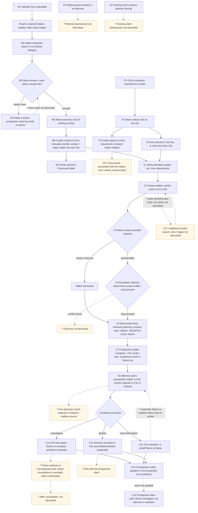

# MatterMind: current intake workflow reconstruction

> **PARKED: DISCOVERY EVIDENCE ONLY.** Committed Oct 2, 2026 when Drew Reutlinger parked intake (option (c)). This record is not approved for implementation and no intake code is to be built. See [`README.md`](./README.md). Edits made when committing: this banner and working-copy paths replaced with repository paths. `brief.md` and `challenge-filecard.md` are team working files that are not committed; see [`team-analysis-summary.md`](./team-analysis-summary.md).

Author: Filecard (independent phase 1 work, per `brief.md`). Prepared Oct 2, 2026 (MT). Revised Oct 2, 2026 after the cross-challenge round (see the last section and `challenge-filecard.md`).
Status: RECORD of the current workflow. This file fills no gaps and proposes no solutions.
Scope: intake → conflict check → attorney assignment → follow-up → entry into Clio, as described in interviews 001 (Rachel Morgan, Director of Legal Operations), 002 (Maria Santos, Intake Coordinator) and 003 (David Chen, Employment Attorney). This is a simulated engagement: all people, the firm and all data are fictional.

## How to read this file

**Evidence labels** are the repo's labels, used exactly as `brief.md` defines them:

- **FACT:** something a stakeholder explicitly said. Each one carries a cite and a short verbatim quote.
- **OBSERVATION:** something noticed during discovery. Two kinds:
  - observations recorded in the interview notes, cited like facts;
  - my own cross-source notes, marked "OBSERVATION (Filecard)".
- **HYPOTHESIS:** not validated. In this file, every **ASSUMED** item is a HYPOTHESIS.
- **OPEN QUESTION:** something still to investigate. In this file, every **GAP** is an OPEN QUESTION.
- **CONSTRAINT:** a boundary set during discovery.

**Step status values:**

- **KNOWN:** backed by a cited FACT, or by a cited source OBSERVATION where the record says so.
- **ASSUMED:** a sequence or behaviour the step seems to need but that no source states.
- **GAP:** no source covers it.

**Cite format:** `002 §Website intake workflow › Clio entry` means interview 002, under that section heading. Quotes are verbatim from `docs/discovery/001`–`003` as of commit `5c9015c`. All interview dates are "Not provided" in the records.

**Interviews 004 and 005:** I read 004 (Karen Mitchell, paralegal) and 005 (Lisa Grant, legal assistant) read-only from `CoderDrew/legal-system` `docs/discovery/`, only to check them against the intake facts here.
- Neither one adds independent evidence about the intake workflow. Their intake mentions only restate 001–003 (004 §Emerging cross-workflow pattern; 005 §Cross-workflow findings › Intake).
- **Not used as evidence.** One adjacent fact: 004 §Stakeholder role and tools says "Karen supports several attorneys, including David Chen." That does **not** establish who "David's assistant" is in the scheduling step, so it isn't used.

**Context, not resolved here:** per `brief.md`, the repo's already-approved V1 direction is active-matter status, not intake. Duke is flagging that to Drew.

---

## 1. Current workflow by intake path

The sources show four entry paths: **website** (W), **phone via reception** (P), **referral direct to an attorney** (R), and **existing client direct to an attorney** (E).
- Only W and P are described step by step. Both are described by Maria (002), with Rachel's high-level corroboration (001).
- W and P converge into one **common downstream** sequence (C): conflict check, attorney assignment, attorney review, decision and follow-up. That sequence is described by Maria (002) and David (003).
- R and E appear only as one-line FACTs in 001. Everything after their first step is GAP.

The converged sequence as Maria described it (002 §Phone intake differences, verbatim numbered list): "Prospective client or matter entered in Clio." → "Relevant parties identified." → "Conflict search performed." → "Possible conflicts reviewed and, when appropriate, escalated." → "Attorney determined." → "Prospective matter assigned." → "Review task created." → "Attorney review performed."

### 1W. Website inquiry path

| # | Step | Actor | System / tool | Inputs | Outputs | Recorded where | Evidence | Status |
|---|---|---|---|---|---|---|---|---|
| W1 | Prospective client submits the website form; it becomes an email in the shared mailbox | Prospective client | Website form (platform unknown) → Outlook shared mailbox | Name, email, phone, type of legal help, how they heard of the firm, free-text description, attachments | Email in the shared mailbox | Outlook shared mailbox "New Client Intake" | FACT 002 §Website intake workflow › Inquiry arrival: "Website inquiries arrive in a shared Outlook mailbox named “New Client Intake.”" / "The website form places submitted information into an email." Corroborated at high level by FACT 001 §Matter intake › Entry paths: "Website inquiries generally reach the intake team." Source OBSERVATION, same section: "The incoming email did not itself appear to create a record in Clio." | KNOWN. Form technology: GAP (002 §Open questions) |
| W2 | An intake employee claims the inquiry | One of four intake employees (Maria handles most) | Outlook categories named for staff members | Unclaimed email | Category applied to the email | Outlook (category on the email) | FACT 002 §Website intake workflow › Intake ownership: "Applying a person's category indicates that the person is handling the inquiry." / "Opening an email does not establish ownership." / "Four employees have access to the mailbox." FACT 002 §Stakeholder role: "Maria handles most website inquiries and many phone inquiries routed through reception." | KNOWN. Who the four employees are: GAP |
| W3 | Initial review of the submission | Maria | Outlook (email, attachments) | Submission | Her understanding of the issue, and a judgment on whether there's enough information | **Not stated** | FACT 002 §Website intake workflow › Initial review: "Maria reads the submission to determine what the prospective client is contacting the firm about and whether enough information has been provided to proceed." / "Prospective clients do not always select the correct practice area." | KNOWN. Where the review result is recorded: GAP |
| W4 | (If needed) Collect more information from the prospective client | Maria | Email or phone | Gaps in the submission | Additional information | **Not stated** | FACT 002 §Website intake workflow › Initial review: "When necessary, Maria contacts the prospective client by email or phone to collect additional information." | KNOWN. Where the collected information is recorded, and how the step resumes: GAP |
| W5 | Search Clio for an existing contact | Maria | Clio | Prospective client's name | Existing contact, or no match | Clio (search; no record created) | FACT 002 §Website intake workflow › Clio entry: "Maria searches Clio for the prospective client's name before creating a new contact." / "The person may already exist as an existing client, a former client, or someone who previously contacted the firm." | KNOWN |
| W6 | Create the contact if needed, and transfer the information into Clio by hand | Maria | Outlook → Clio (manual re-keying) | Website email contents | Clio contact, plus "basic matter information" (the prospective matter) | Clio | FACT 002 §Website intake workflow › Clio entry: "If no appropriate contact exists, Maria creates one." / "Maria manually transfers contact information and basic matter information from the website inquiry into Clio." Known error modes, FACT same section: "Examples reported by Maria include incorrectly entered phone numbers, misspelled names, and duplicate contacts." | KNOWN. Which Clio object or fields hold the "prospective matter", and whether attachments are copied into Clio: GAP |
| W7 | File the email | Intake employee | Outlook folder | Email already entered into Clio | Email in the Processed folder | Outlook "Processed" folder | FACT 002 §Website intake workflow › Intake ownership: "After an inquiry has been entered into Clio, the email is moved into a Processed folder." | KNOWN |
| → | Continue to C1 | | | | | | | |

**Known failure modes in this path:**
- **Duplicate claiming.** FACT 002 §Website intake workflow › Intake ownership: "Maria reported that two people occasionally begin working on the same inquiry at approximately the same time."
- **Unclaimed inquiries.** FACT, same section: "Maria reported that inquiries sometimes remain unclaimed longer than intended when staff are busy or assume someone else is handling them."
- **Prospective clients chasing a response.** FACT, same section: "Prospective clients have called about inquiries submitted the previous day after not receiving a response."
- **No known lost inquiries.** FACT, same section: "Maria is not aware of an inquiry being completely lost."

### 1P. Phone inquiry path (via reception)

| # | Step | Actor | System / tool | Inputs | Outputs | Recorded where | Evidence | Status |
|---|---|---|---|---|---|---|---|---|
| P1 | Call arrives at reception and is transferred to intake | Reception | Phone (system not stated) | Prospective-client call | Call with an intake staff member | **Not stated** | FACT 001 §Matter intake › Entry paths: "Telephone inquiries generally go through reception and are routed to intake." FACT 002 §Phone intake differences: "Reception may transfer prospective-client calls to intake staff." | KNOWN. What happens when a call is *not* transferred ("generally", "may"): GAP |
| P2 | Intake staff member takes the call and collects information | Maria | Phone | The caller's account | Contact information, the nature of the issue, other people or organizations involved | See P3 | FACT 002 §Phone intake differences: "Maria speaks with the caller and collects information such as contact information, the nature of the legal issue, and other people or organizations involved." | KNOWN |
| P3 | Enter the information into Clio, either live or from notes afterward | Maria | Clio (and notes) | Information from the call | Clio contact or prospective matter | Clio. Where interim notes are kept: not stated. | FACT 002 §Phone intake differences: "Maria may enter information directly into Clio while speaking with the caller." / "If the conversation is complicated or moving quickly, Maria may take notes first and enter the information into Clio afterward." | KNOWN. Location of notes: GAP. Whether the W5 search-before-create step is also done here: ASSUMED (not stated for phone) |
| P4 | Documents requested by email | Maria → prospective client | Outlook shared intake mailbox | Caller's supporting documents | Email with attachments in the shared mailbox | Outlook shared mailbox | FACT 002 §Phone intake differences: "If the prospective client has supporting documents, Maria asks the person to email them to the shared intake mailbox." | KNOWN |
| P5 | Associate the separately received documents with the intake | Maria (implied by "Maria was handling") | Not stated | Document email | Documents linked to the prospective client or intake | **Not stated** | FACT 002 §Phone intake differences: "Separately received documents must then be associated with the prospective client or intake Maria was handling." | KNOWN that it must happen. How, where and by whom: GAP. Whether these emails also go through the W2/W7 category and Processed-folder handling: GAP |
| → | Continue to C1 | | | | | | FACT 002 §Phone intake differences: "The phone workflow is substantially similar to the website workflow after information has been entered into Clio." / "The primary difference is how the initial information is captured." | KNOWN |

### 1R. Referral path (direct to attorney)

| # | Step | Actor | System / tool | Inputs | Outputs | Recorded where | Evidence | Status |
|---|---|---|---|---|---|---|---|---|
| R1 | Referral reaches an attorney directly | Referral source → attorney | Not stated | Referral | Not stated | Not stated | FACT 001 §Matter intake › Entry paths: "Referrals may go directly to attorneys." | KNOWN (that it can happen) |
| R2+ | Everything after R1: whether intake is involved, Clio entry, party identification, conflict check, assignment | — | — | — | — | — | No source. Listed in `open-questions.md` §Matter intake and conflict checking: "What happens when referrals or existing-client issues reach an attorney directly?" | **GAP** |

### 1E. Existing-client path (direct to attorney)

| # | Step | Actor | System / tool | Inputs | Outputs | Recorded where | Evidence | Status |
|---|---|---|---|---|---|---|---|---|
| E1 | An existing client contacts an attorney directly about a new issue | Existing client → attorney | Not stated | New issue | Not stated | Not stated | FACT 001 §Matter intake › Entry paths: "Existing clients may contact attorneys directly regarding new issues." | KNOWN (that it can happen) |
| E2+ | Everything after E1 | — | — | — | — | — | No source (same open question as R2+). Related: an existing client who comes in through the *website* path is caught at W5, per FACT 002 §Website intake workflow › Clio entry: "The person may already exist as an existing client, a former client, or someone who previously contacted the firm." | **GAP** |

### 1C. Common downstream sequence (after W or P)

**Conflict check**

| # | Step | Actor | System / tool | Inputs | Outputs | Recorded where | Evidence | Status |
|---|---|---|---|---|---|---|---|---|
| C1 | Identify opposing and other relevant parties, including from attachments | Maria | Outlook (submission and attachments) | Submission text and documents | List of names for the conflict search | Entered into Clio at C2 | FACT 002 §Website intake workflow › Party identification: "Before running the conflict search, Maria identifies opposing parties and other relevant parties." / "Maria may need to open and review attachments to determine which names should be included in the conflict search." Corroborated by FACT 001 §Matter intake › Conflict checking: "Intake enters the prospective client and known related or opposing parties for conflict checks." | KNOWN |
| C2 | Add the parties and run the Clio conflict search | Maria | Clio conflict search | Prospective client and parties | Possible matches | Clio. Whether the search and its results are retained: not stated. | FACT 002 §Website intake workflow › Conflict search and review: "Maria adds relevant parties and runs the conflict search in Clio." / "Clio can return multiple possible matches." FACT 001 §Matter intake › Conflict checking: "Clio searches existing and former clients, matters, and associated parties for potential matches." | KNOWN. Audit or history of searches: GAP (002 §Open questions) |
| C3 | Review the matches: dismiss clearly irrelevant ones, escalate questionable ones | Maria | Clio results; escalation channel not stated | Possible matches | Dismissed matches, or an escalation to an attorney | **Not stated** | FACT 002 §Website intake workflow › Conflict search and review: "Clearly irrelevant matches can be dismissed." / "Questionable results are escalated to an attorney." / "Maria does not make the final determination that an actual legal conflict exists." CONSTRAINT, same section: "Human judgment is an intentional part of the current conflict-review process." FACT 002 §Conflict-review boundary: "Name matches can be ambiguous." | KNOWN. Escalation channel, which attorney, criteria for what counts as clearly irrelevant, and how a dismissal is recorded: GAP |
| C4 | Attorney decides whether there's an actual conflict and whether the firm may proceed | An attorney (which one: not stated) | Not stated | Escalated matches | Proceed / don't proceed | **Not stated** | FACT 001 §Matter intake › Conflict checking: "The attorney determines whether an actual conflict exists and whether the firm may proceed." | KNOWN. Where the determination is recorded, and what happens when an actual conflict is found: GAP |
| C5 | Additional conflict search when parties are identified later | Not stated | Clio (implied by "conflict search") | Newly identified party | Additional search | Not stated | FACT 002 §Website intake workflow › Party identification: "Maria reported that parties have occasionally been identified later that were not included in the original conflict check." / "When this happens, an additional conflict search must be performed." / "Attorneys have asked whether particular people were checked and discovered that they were not included in the original search." | KNOWN that it must happen. Who runs it, what triggers it and when, and where it's recorded: GAP |

**Attorney assignment**

| # | Step | Actor | System / tool | Inputs | Outputs | Recorded where | Evidence | Status |
|---|---|---|---|---|---|---|---|---|
| C6 | Decide which attorney should review | Maria | Institutional knowledge; Excel spreadsheet in SharePoint; Microsoft Teams | Practice area, rotation, attorney availability | Chosen attorney | Assignment recorded at C7. The reasoning behind the choice: not stated. | FACT 002 §Website intake workflow › Attorney assignment: "After the conflict process permits intake to continue, Maria determines which attorney should review the prospective matter." / "Practice area is an important factor in attorney assignment." / "Attorney assignment is not automatically determined by Clio." / "Part of that process exists as institutional knowledge among staff." / "A small Excel spreadsheet stored in SharePoint contains information about which attorneys are taking new consultations and which attorneys are unavailable." / "Maria stated that the spreadsheet is not always current." / "When she is unsure, Maria may contact someone through Microsoft Teams to determine who should receive the matter." | KNOWN. Rotation rules beyond practice area and availability, spreadsheet ownership, and whom she asks on Teams: GAP (002 §Open questions) |
| C7 | Assign the prospective matter and create a Clio review task, sometimes with an email or Teams message as well | Maria | Clio task; Outlook or Teams | Chosen attorney | Assignment, review task, optional message | Clio (assignment and task). Outlook or Teams for the extra message. | FACT 002 §Website intake workflow › Handoff and post-handoff status: "Maria assigns the prospective matter to the appropriate attorney and creates a Clio task requesting review." / "Depending on the attorney or practice group, Maria may also send an email or Teams message." / "Maria stated that some attorneys are better than others about monitoring their Clio tasks." Source OBSERVATION 002 §Direct observations: "The official Clio task handoff is sometimes supplemented by other communication channels because staff do not consider task monitoring equally reliable across attorneys." Corroborated (David describing Maria's step) by FACT 003 §Intake handoff: "Maria's intake workflow formally hands prospective matters to attorneys through Clio." | KNOWN |

**Attorney review and decision**

| # | Step | Actor | System / tool | Inputs | Outputs | Recorded where | Evidence | Status |
|---|---|---|---|---|---|---|---|---|
| C8 | Attorney receives the task and reviews the intake and the original materials | David (one employment attorney) | Clio; Outlook or "another linked location"; Word / M365 | Clio task; intake record; original submission and documents | His understanding of the matter ("getting the story straight"): what happened, when, who was involved, what the prospective client wants, potentially important deadlines, available documentation, whether the firm handles it, what is missing | **Not stated** | FACT 003 §Intake handoff: "David receives a Clio task informing him that a prospective matter is ready for review." / "David opens the prospective matter in Clio and reviews the information recorded by intake." FACT 003 §Reviewing original material: "David does not rely solely on the intake summary." / "He wants to review what the prospective client actually submitted." / "Depending on how intake was processed, relevant documents may be associated with the prospective matter, or David may need to locate the original intake material through Outlook or another linked location." FACT 003 §Attorney review goals: "During initial review, David is trying to understand what happened, when it happened, who was involved, and what the prospective client wants." / "He also considers potentially important deadlines, available documentation, whether the issue is potentially a matter the firm handles, and what information is missing." FACT 003 §Time spent reviewing intakes: "David estimated that reviewing a simple prospective matter may take approximately 5–10 minutes." / "He estimated that a more complicated intake involving a long narrative and multiple documents may take approximately 20 minutes or longer." / "David may have several prospective matters waiting for review while he is also working on active client matters." (CONSTRAINT: these are estimates, not measurements.) | KNOWN for David. Whether other attorneys work the same way: GAP (CONSTRAINT 003 §Important boundaries: "Do not assume that every attorney follows David's workflow."). How David reaches originals "through Outlook", and whether attorneys can access the shared mailbox: GAP (G16) |
| C9 | Attorney decides: consultation, more information, or decline | Attorney | Not stated | Review result | Decision | See C10–C13 | FACT 002 §Website intake workflow › Handoff and post-handoff status: "The attorney decides whether to schedule a consultation, request additional information, or decline the potential matter." | KNOWN |

**Follow-up and entry into Clio**

| # | Step | Actor | System / tool | Inputs | Outputs | Recorded where | Evidence | Status |
|---|---|---|---|---|---|---|---|---|
| C10 | **Consultation:** the decision is handed off for scheduling | David → his assistant | Clio task **and/or** Teams / direct message | Decision to consult | Scheduling request | Clio (task) **and/or** outside Clio (Teams) | Source OBSERVATION 003 §Decision: proceed to consultation: "He updated the prospective matter in Clio." FACT, same section: "David can create or update a task indicating that a consultation should be scheduled." / "David acknowledged that he sometimes communicates this directly to his assistant through another channel, such as Teams." / "An example of that communication is, “Can you get this person on my calendar?”" / "David's assistant commonly handles consultation scheduling." Source OBSERVATIONs, same section: "Clio provides the formal workflow, but Teams or other direct communication may become the practical workflow for some handoffs." / "This is consistent with Maria's description of sometimes supplementing Clio tasks with Teams or email." | KNOWN. Whether the Teams message replaces the Clio task or accompanies it: GAP (G17). Who the assistant is, where the consultation is recorded (which calendar), and who confirms with the prospective client: GAP |
| C11 | **More information needed:** the request goes back to intake | David → Maria | Clio note or task, **or** email / Teams | Unresolved questions | Request to intake | Clio **or** outside Clio | FACT 003 §Decision: additional information needed: "The expected workflow can involve recording a note or creating or updating a task in Clio so intake knows what is required." / "David may instead communicate the request directly to Maria through email or Teams." | KNOWN. That Maria then contacts the prospective client and the matter goes back to C8: ASSUMED (no source describes it) |
| C12 | **Decline:** the decision is recorded and communicated | David | Clio status, field, note or task (expected) | Decision not to proceed | Updated Clio state (expected) | Clio (expected) | FACT 003 §Decision: do not proceed: "David may decide that the firm should not proceed with a prospective matter." / "Reasons can include the matter being outside the firm's practice area, the firm not handling that type of issue, capacity considerations, or other matter-specific reasons." / "If the appropriate Clio status, field, note, or task is not updated, intake may still see what appears to be a pending prospective matter." CONSTRAINT, same section: "This interview does not establish a complete decline-decision policy." | KNOWN. Who tells the prospective client, and how: GAP |
| C13 | Expected update of the prospective matter in Clio after the decision | Attorney (implied) | Clio | Decision | Updated prospective matter | Clio, done inconsistently | FACT 002 §Website intake workflow › Handoff and post-handoff status: "The expected process is for the prospective matter to be updated in Clio." / "Maria reported that this update does not happen consistently." | KNOWN. Which fields or statuses are expected: GAP (003 §Open questions) |
| C14 | Status inquiry: the prospective client calls; intake investigates by hand | Prospective client → Maria → attorney or assistant | Phone; direct contact (channel not stated) | Status question | Status answer | **Not stated** | FACT 002 §Website intake workflow › Handoff and post-handoff status: "Maria sometimes has to investigate status manually when a prospective client calls asking what is happening." / "That investigation may involve contacting the attorney or the attorney's assistant." Corroborated by FACT 003 §Decision: do not proceed: "When the prospective client later contacts the firm, intake may need to investigate the status manually." | KNOWN |
| END | What happens after the consultation (engagement, conversion to a client matter) | — | — | — | — | — | No source. 003 traces the flow only up to "scheduling, additional information, decline, or other follow-up" (003 §Cross-interview findings). | **GAP** (outside the described range) |

---

## 2. KNOWN vs ASSUMED

### KNOWN (cited FACT, or a cited source OBSERVATION)

- **W1–W7:** the full website capture path, from mailbox to Processed folder. Source: 002.
- **P1–P4:** the phone capture path. Source: 002, corroborated by 001. P5 is known to be required, but its mechanics are not.
- **R1, E1:** both direct-to-attorney entry paths exist. Source: 001 only.
- **C1–C4:** party identification, conflict search, review, dismissal or escalation, and the attorney's determination. Sources: 002 and 001.
- **C5:** a re-check is required when parties are found later. Source: 002.
- **C6–C7:** attorney assignment inputs, the Clio task, and supplementary messages. Source: 002.
- **C8–C9:** attorney review and the three outcomes. Sources: 003 and 002.
- **C10–C12:** how each outcome is handed off. C10 uses Clio *and/or* side channels; C11 uses Clio *or* side channels; C12 is expected in Clio. Source: 003.
- **C13–C14:** the expected Clio update is inconsistent, and status gets investigated by hand. Sources: 002, corroborated by 003.
- **One source OBSERVATION only:** at C10, David updating the prospective matter in Clio was *observed* in the example, not stated as a general practice.

### ASSUMED (HYPOTHESIS: needed for a continuous flow, but stated nowhere)

| ID | Assumption | Why it's not KNOWN |
|---|---|---|
| A1 | The phone path includes the W5 search for an existing contact before a new one is created | The search is described only under the website workflow. For phone, 002 says only that the paths are "substantially similar" *after* information is in Clio. |
| A2 | After C11 (more information needed), Maria contacts the prospective client and the matter goes back to attorney review | 003 describes only how the request reaches intake. No source describes what happens next. |
| A3 | Maria (or another intake employee) runs the W/P → C steps for phones as for the website, not reception | 002 describes Maria. Who the other three mailbox users are, and whether they do phone intake, isn't stated. |
| A4 | The "attorney" consulted at conflict escalation (C3/C4) is identifiable and distinct from the reviewing attorney assigned at C6 | The sequence puts escalation before assignment (002 converged list), but no source says which attorney receives conflict escalations. |

### GAP (OPEN QUESTION: no source)

| ID | Gap | Step | Existing source question, if any |
|---|---|---|---|
| G1 | The whole downstream for referrals | R2+ | `open-questions.md`: "What happens when referrals or existing-client issues reach an attorney directly?" |
| G2 | The whole downstream for existing clients who go directly to an attorney | E2+ | Same as G1 |
| G3 | Which Clio object, fields and statuses represent a "prospective matter" and attorney decisions | W6, C13 | 003: "What Clio fields, statuses, or tasks are expected to represent attorney decisions?" |
| G4 | Where intake documents are stored after processing; whether attachments go into Clio; how phone-path documents are associated | W6, P5, C8 | 003: "Where are submitted intake documents normally stored after intake processing?" |
| G5 | Conflict escalation: channel, recipient, criteria for what counts as clearly irrelevant, where the determination is recorded | C3, C4 | `open-questions.md`: "What steps and roles are involved between a potential conflict match and an attorney's determination?" |
| G6 | What happens when an actual conflict is found | C4 | none |
| G7 | Late-party re-check: who runs it, what triggers it, when, where it's recorded | C5 | `open-questions.md`: "How are newly discovered related or opposing parties handled after the initial conflict check?" |
| G8 | Assignment rules beyond practice area and availability; spreadsheet ownership and upkeep; who is asked on Teams | C6 | 002: "What determines the attorney rotation beyond practice area and availability?" / "Who owns and maintains the attorney-availability spreadsheet?" |
| G9 | What counts as "complete enough" for attorney review | W3, C7 | 002: "What information is required before an intake is considered complete enough for attorney review?" |
| G10 | Communications to the prospective client: acknowledgement, consultation confirmation, decline notice. Who sends them, through what, and where they're recorded | W2–W4, C10, C12 | none (Filecard) |
| G11 | Who the scheduling assistant is, and where consultations are recorded | C10 | none |
| G12 | Where W3/W4 review results and extra information are recorded | W3, W4 | none |
| G13 | Phone exceptions: calls not transferred, and where call notes are kept | P1, P3 | none |
| G14 | Whether practice groups or attorneys follow materially different processes | all | 002: "Do different practice groups follow materially different intake or attorney-assignment processes?"; 003: "How representative is David's workflow across other attorneys and practice groups?" |
| G15 | What happens after the consultation | END | none |
| G16 | Attorney access to original submissions: how David reaches originals "through Outlook", and whether attorneys can access the shared mailbox (002 §Inquiry arrival: "Four employees have access to the mailbox.") | C8 | 003: "What security and permission boundaries apply when attorneys access prospective-client submissions?" |
| G17 | At C10, whether the Teams or direct message replaces the Clio scheduling task or accompanies it | C10 | none |

---

## 3. Contradictions and tensions between stakeholders

Types:
- **CONTRADICTION:** the accounts can't both be true as stated.
- **TENSION:** the stated rule and the described practice diverge.
- **UNRECONCILED:** one account covers something the others don't address.

Every type assignment below is an OBSERVATION (Filecard), not a stakeholder claim. No direct CONTRADICTION was found: the sources disagree through tension and omission, not head-on.

| # | Rachel (001): the process as described | Maria (002) / David (003): the process as practised | Type | Note |
|---|---|---|---|---|
| X1 | 001 §Matter intake › Conflict checking: "A conflict check occurs before substantive attorney involvement." | 002 §Party identification: "Maria reported that parties have occasionally been identified later that were not included in the original conflict check." / "Attorneys have asked whether particular people were checked and discovered that they were not included in the original search." | TENSION | Rachel's own record allows for this: 001 §Matter intake › Conflict checking says "All relevant parties may not yet be known during intake." Maria also: "Maria is not aware of the firm accepting a matter it should not have accepted because of one of these omissions." |
| X2 | 001 §Matter intake › Entry paths: "Referrals may go directly to attorneys." / "Existing clients may contact attorneys directly regarding new issues." | 003 §Stakeholder role and tools: "David receives prospective employment matters from the intake team." 002 §Stakeholder role: "Maria coordinates prospective-client intake before attorney review." | UNRECONCILED | Neither Maria nor David describes a matter reaching an attorney without passing through intake. 001's own observation: "The intake paths described do not all begin with the intake team." It's unknown how X1's rule (conflict check before attorney involvement) applies to these paths. |
| X3 | 001 §Practice management: "Clio is the firm's primary matter-management system." | 002 §Intake ownership: "They use Outlook categories named for individual staff members." 002 §Attorney assignment: "A small Excel spreadsheet stored in SharePoint contains information about which attorneys are taking new consultations and which attorneys are unavailable." 003 §Decision: additional information needed: "David may instead communicate the request directly to Maria through email or Teams." | TENSION (acknowledged) | Not a contradiction: Rachel also says (001 §Microsoft 365 / Outlook) "A significant amount of actual work occurs outside Clio." CONSTRAINT 003 §Important boundaries: "Do not characterize Clio as failing or being rejected by users." |
| X4 | 001 contains no account of attorney assignment | 002 §Attorney assignment: "Part of that process exists as institutional knowledge among staff." / "Maria stated that the spreadsheet is not always current." | UNRECONCILED | The management-level account has no assignment step. The frontline account shows it lives partly outside any system. |

| # | Maria (002) | David (003) | Type | Note |
|---|---|---|---|---|
| X5 | §Handoff and post-handoff status: "The expected process is for the prospective matter to be updated in Clio." / "Maria reported that this update does not happen consistently." | §Decision: proceed to consultation (source OBSERVATION): "He updated the prospective matter in Clio." But FACT: "David acknowledged that he sometimes communicates this directly to his assistant through another channel, such as Teams." §Decision: do not proceed: "David stated that the primary workflow issue is how the decision is recorded and communicated, rather than his ability to make the decision." | CORROBORATED, with different emphasis | Both say decision state sometimes lives outside Clio. In the observed example, David did update Clio. CONSTRAINT 003 §Cross-interview findings: "This behavior must not be generalized to every attorney, practice group, or matter without further validation." |
| X6 | §Intake ownership: "After an inquiry has been entered into Clio, the email is moved into a Processed folder." §Phone intake differences: "Separately received documents must then be associated with the prospective client or intake Maria was handling." | §Reviewing original material: "Depending on how intake was processed, relevant documents may be associated with the prospective matter, or David may need to locate the original intake material through Outlook or another linked location." | UNRECONCILED | Maria never says website attachments are put into Clio. David says sometimes they aren't there. Where originals end up is not established (G4). |
| X7 | §Handoff and post-handoff status: "Maria assigns the prospective matter to the appropriate attorney and creates a Clio task requesting review." / "Maria stated that some attorneys are better than others about monitoring their Clio tasks." | §Intake handoff: "David receives a Clio task informing him that a prospective matter is ready for review." | Consistent for David; TENSION across attorneys | David's account matches the formal handoff. Maria's statement covers attorneys who weren't interviewed. |
| X8 | §Stakeholder-identified pain points: "Website information must be manually transferred from Outlook into Clio." | §Attorney pain point: information comprehension: "David spends time understanding potentially lengthy submissions before deciding what requires deeper review." | Different emphasis (not a contradiction) | Source OBSERVATION 003: "David's primary pain point differs from Maria's reported pain points." |

---

## 4. Missing information that blocks a correct picture

These are listed by how much they block. None of them is filled in here.

1. **The direct-to-attorney paths (G1, G2).** Two of the four entry paths have no description beyond their first step. Missing: whether intake, Clio entry and the conflict check happen at all on these paths, by whom and when.
2. **Clio representation (G3).** Missing: what a "prospective matter" is in Clio, and which status, field, note or task is supposed to carry each decision. Without this, entry into Clio, and what it means for something to be updated in Clio, can't be pinned down.
3. **Conflict escalation and outcome (G5, G6, G7).** The record stops at "escalated to an attorney". Missing: how escalation is done, how the determination is recorded, what happens on a real conflict, and how late-found parties are re-checked.
4. **Document custody (G4).** Missing: where submitted documents live after intake, for both paths. This affects C1, C8 and the X6 discrepancy.
5. **Prospective-client communications (G10).** No source describes acknowledgement, consultation confirmation or decline notices. That leaves the "follow-up" leg only partly described.
6. **Assignment logic (G8).** Missing: the rotation rules, the spreadsheet's owner and why it goes stale, and who is consulted on Teams.
7. **Representativeness (G14).** One intake coordinator and one employment attorney were interviewed. CONSTRAINT 002 §Cross-interview context: "Agreement between these two stakeholders must not be treated as proof that every practice group or employee follows the same process."
8. **Completeness criterion (G9).** Missing: what counts as "enough information" at W3, and what is "complete enough for attorney review".
9. **Source integrity.** 001 is partial: 001 §Meeting record says "Partial. The supplied notes end during the Microsoft 365 / Outlook section." Also, no interview has a date, and `discovery-log.md` is stale (it lists only 001).
   - Two cross-interview attributions to Rachel can't be traced to 001, so neither is used as evidence here:
     - 002 §Cross-interview context credits 001 with "Information is not consistently returned to Clio." No such line is in 001. The nearest is 001 §Microsoft 365 / Outlook: "A significant amount of actual work occurs outside Clio." The same list's "Microsoft 365 and Outlook are major locations where daily work occurs." paraphrases 001's "Microsoft 365 is heavily used."
     - 003 §Related active-matter lead attributes “Where are we on this matter?” to Rachel. That question isn't in 001; the nearest is 001 §Candidate workflows for investigation: "Rachel identified determining the current state of an active matter as an area that repeatedly generates complaints."
   - Stale post-handoff Clio state is evidenced here only by Maria (002) and David (003).
10. **Volume, timing and frequency.** Missing: how many inquiries come in, how long intake takes, and how often duplicates, late parties and status chases happen. All are open questions in 002 and 003. The only durations are David's estimates.

---

## 5. Flowchart of the cited workflow

Solid nodes and edges are cited (KNOWN). Dashed `gap` nodes and dashed edges are GAP or ASSUMED (`?`). The syntax was validated with `@mermaid-js/mermaid-cli` (mmdc).

---

## Changes after challenge round (Oct 2, 2026)

Source: the cross-challenge of the Recondo, Mainframe and Dial-Tone analyses (`challenge-filecard.md`). Every added quote was checked verbatim against 001–003. No gap was filled and nothing was proposed.

1. **C10 corrected: "or" → "and/or"** (step table, §2 KNOWN list, chart node). My exclusive "or" overstated 003 §Decision: proceed to consultation. The source says David "can create or update a task" and "sometimes communicates this directly to his assistant through another channel, such as Teams". It frames such channels as "supplementing Clio tasks", and never says whether the message replaces the task. Mainframe's and Dial-Tone's "both" overstates it the other way. **New gap G17:** replace vs accompany. Also added: the verbatim example "Can you get this person on my calendar?" and the two source OBSERVATIONs (L65–66). C11 keeps "or", because 003 says "may instead".
2. **Chart: the C5 trigger was moved off C8.** The old edge `C8 -.-> C5` placed the discovery of a late party at attorney review. 002 doesn't say when or by whom late parties are found. The dashed edge now comes from the original search (C2) and is labelled "when / by whom not described". Raised by Dial-Tone Q6 and M4.
3. **C8 evidence added (KNOWN status unchanged):**
   - 003 §Attorney review goals: what David looks at;
   - 003 §Reviewing original material: "He wants to review what the prospective client actually submitted.";
   - 003 §Time spent reviewing intakes: the 20+ minute estimate and the "several prospective matters waiting" queue fact.
   These came from Recondo and Dial-Tone. **New gap G16:** how attorneys reach originals and mailbox access (002 says four employees have mailbox access; 003 has an OPEN QUESTION on attorney access). Raised by Dial-Tone Q17, Mainframe OQ 11 and Recondo Q7.21. A dashed chart node C8G was added.
4. **C12:** the decline reasons from 003 §Decision: do not proceed were added. Raised by Recondo 4.9 and Dial-Tone D7.
5. **C7:** the source OBSERVATION giving the reason for supplementary messages (002 §Direct observations) was added, plus David's corroborating account of the formal Clio handoff (003 §Intake handoff), labeled as his account of Maria's step. Raised by Recondo and Dial-Tone.
6. **C3:** "Name matches can be ambiguous." (002 §Conflict-review boundary) was added. Raised by Mainframe.
7. **§4 item 9, Source integrity:** the two Rachel attributions that can't be traced to 001 are now recorded (002 §Cross-interview context; 003 §Related active-matter lead). The reconstruction never used either one as evidence, so no step changed. Recording them makes it explicit that stale Clio state rests on 002 and 003 alone.
8. **Unchanged after challenge:** C13's "inconsistently" (vs analysts' "often"); W7's Processed folder as Clio-entry marker, not ownership; G3 as a GAP (vs Recondo's "Pending status"); X1's note that 001 anticipates unknown parties (vs Mainframe's "understates"). The source supports the reconstruction on each of these. No KNOWN/ASSUMED/GAP status was changed except the additions G16 and G17. No contradiction (X1–X8) was added or removed.
9. The chart was re-rendered with mmdc after these edits, and the syntax is valid.

